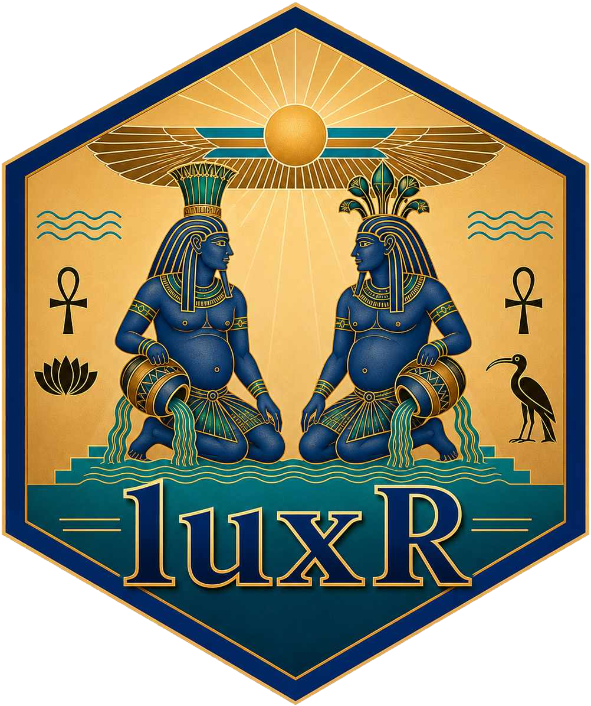

# luxR 

**Underwater Light Analysis and Visual Ecology**

luxR provides tools for quantifying and modelling underwater light
environments. It propagates spectral irradiance through the water column
via Beer-Lambert attenuation, converts between energy and photon-flux
units, and estimates photoreceptor excitation and visual contrast.

[](https://github.com/JohnKirwan/luxR/actions)
[](https://johnkirwan.r-universe.dev/luxR)
[](https://johnkirwan.r-universe.dev/luxR)

## Installation

```r
# Release build from r-universe:
install.packages(
  "luxR",
  repos = c(
    luxR = "https://johnkirwan.r-universe.dev",
    CRAN = "https://cloud.r-project.org"
  )
)

# Alternatively, install the development version from GitHub:
# install.packages("remotes")
remotes::install_github("JohnKirwan/luxR")
```

## Quick start

```r
library(luxR)

# Load a coastal irradiance profile as a lux_spectrum object
x <- from_naples("0m")
print(x)
#> <lux_spectrum> irradiance [umol/m2/s/nm] | 352.5-862.5 nm, 5 nm bins (103 pts)

# Convert units
x_W <- convert_unit(x, "W/m2/nm")

# Compute PAR and lux
par_irradiance(x_W)    # µmol m⁻² s⁻¹
irradiance2lux(x_W)    # lux

# Propagate to depth using a Jerlov Type II water model
x_prop <- x_W[350, 700]       # bundled Jerlov Kd is supported here
lam   <- x_prop$lambda
Kd_II <- jerlov_Kd("II", lam)
specs <- propagate_spectrum(x_prop, Kd_II, from = 0,
                            to = c(0, 5, 10, 20, 50))
plot(specs)

# Colour discrimination at depth
grey_R <- lux_spectrum(rep(0.3, length(lam)), lam,
                       quantity = "reflectance", unit = "dimensionless")
red_R  <- lux_spectrum(0.2 + 0.25 * exp(-((lam - 625)/35)^2), lam,
                       quantity = "reflectance", unit = "dimensionless")

colour_jnd(
  stim1    = reflectance_to_radiance(grey_R, specs[["0"]])$E,
  stim2    = reflectance_to_radiance(red_R,  specs[["0"]])$E,
  lambda   = lam,
  species  = "Danio rerio",
  receptor = c("S-cone", "M-cone", "L-cone")
)
```

Default colour models use only cited chromatic receptor combinations from
`species_channels`. Rods, melanopsin channels, and incomplete receptor sets are
not silently treated as additional colour channels.

## Propagation model and limits

luxR's principal modeling tier is wavelength-resolved Beer–Lambert attenuation
with a diffuse attenuation coefficient, Kd(λ). It assumes Kd is constant over
the modeled path and propagates wavelength bins independently. It does not
solve an angular radiance field, multiple scattering, or processes that move
energy between wavelengths; use HydroLight, EcoLight, or WASI when those are
required.

The bundled Jerlov table covers eight optical water types from 350–700 nm.
`jerlov_Kd()` fails outside that range by default; constant endpoint extension
must be explicitly requested and is recorded in result metadata. There is no
universal supported maximum depth—the chosen Kd must remain representative of
the full path. Inverse propagation is a homogeneous-column reconstruction and
can strongly amplify measurement noise.

## Key features

| Area | Functions |
|---|---|
| **Spectral class** | `lux_spectrum()`, `convert_unit()`, `as_lux_spectrum()` |
| **Depth propagation** | `propagate_spectrum()`, `band_irradiance()`, `fit_Kd()`, `jerlov_Kd()` |
| **Photometrics** | `par_irradiance()`, `irradiance2lux()`, `scotopic_lux()` |
| **File I/O** | `from_naples()`, `from_solar()`, `read_trios()`, `from_trios()`, `read_ocean_optics()`, `from_ocean_optics()` |
| **Visual ecology** | `govardovskii_template()`, `quantum_catch()`, `colour_jnd()` |
| **Visibility scenarios** | `secchi_depth()`, `visual_range()`, `detection_range()`, `detectability()` |
| **Interactive app** | `run_app()` |

## Interactive explorer

```r
run_app()   # requires the 'shiny' package
```

`run_app()` launches a bundled Shiny application with guided tabs including:

- **Depth Propagation** — pick a built-in spectrum or upload explicitly
  calibrated Ocean Optics spectral irradiance, attenuate it through a Jerlov
  water type, and download the per-depth lux, photon-flux, calibration, and
  provenance table. TriOS radiance is deliberately excluded because it cannot
  be converted to irradiance without angular measurements.
- **Species Perception** — photoreceptor quantum catch for a chosen species
  under a selected bundled light-source condition at that source's stated
  reference depth.
- **Colour discrimination** — Vorobyev-Osorio JND between two reflectances
  under the in-water light field.
- **Visibility** — Secchi depth, photic depth, and horizontal visual range
  from the water's diffuse attenuation.
- **Detection** — explicitly unvalidated contrast-threshold distance scenarios;
  these are teaching estimates, not predictions of actual organismal detection
  range.

## Documentation

Full function reference and four vignettes are on the
[pkgdown site](https://johnkirwan.github.io/luxR/):

- **Light in the water column** — field data loading, PAR, Kd fitting,
  Jerlov propagation, photic depth
- **From photons to perception** — unit conversions, quantum catch,
  colour discrimination at depth
- **Seeing through water** — an end-to-end object-detection scenario with
  explicit propagation and visual-model assumptions
- **Polarization of the underwater light field** — the scope, validation, and
  use of the tunable Rayleigh-like polarization approximation

## License

GPL (>= 3)
