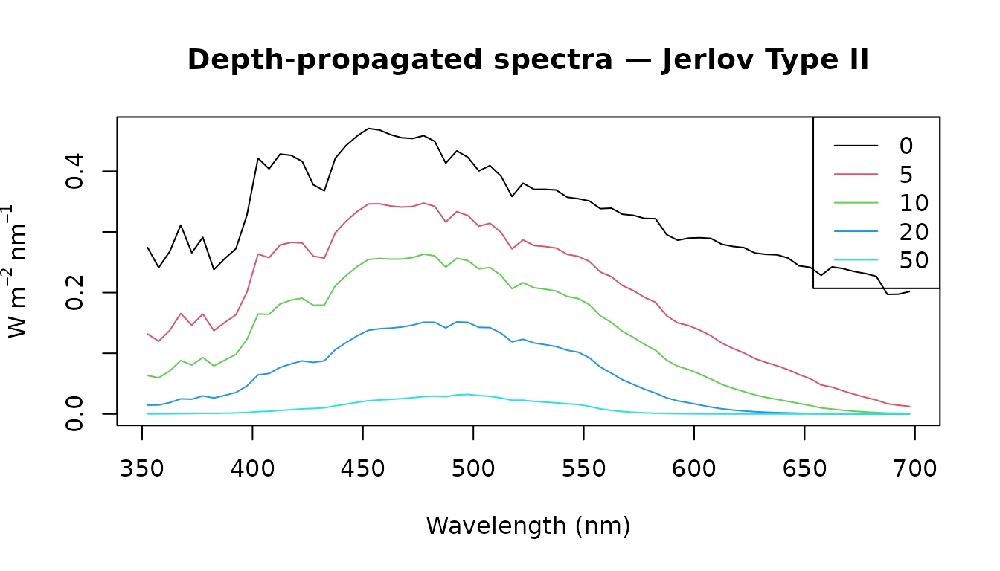

# Light in the water column

A researcher has deployed irradiance sensors at three depths on a
coastal reef and wants to quantify how the light field changes with
depth — both from direct measurements and extended to greater depths
using a standard optical water-type model.

## Loading field data

The `Naples` dataset ships with luxR: spectrally resolved photon-flux
irradiance measured at 0, 5, and 10 m depth at a coastal Mediterranean
site.
[`from_naples()`](https://johnkirwan.github.io/luxR/reference/from_naples.md)
wraps it in a `lux_spectrum` object that carries the wavelengths, unit,
and metadata.

``` r

library(luxR)

x0m  <- from_naples("0m")
x5m  <- from_naples("5m")
x10m <- from_naples("10m")

x0m
```

    ## <lux_spectrum> irradiance [umol/m2/s/nm] | 352.5-862.5 nm, 5 nm bins (103 pts)
    ##   depth: 0m
    ##   source: Naples
    ##   reference_depth_m: 0
    ##   reference_medium: water
    ##   provenance: Naples
    ##    provenance: naples-mare-chiaro-legacy
    ##    provenance: naplesBokKirwan2021
    ##    provenance: unpublished-author-provided-data
    ##    provenance: not-applicable
    ##    provenance: 2021-12-31
    ##    provenance: legacy bundled snapshot; redistribution terms not documented
    ##    provenance: legacy canonical snapshot extracted from luxR commit 2375244
    ##    provenance: data-raw/naples_legacy_snapshot.csv
    ##    provenance: 5952acfab4a04ea1b02eb085e6a768d5
    ##    provenance: wv=nm;depth_0m|depth_5m|depth_10m=umol/m2/s/nm
    ##    provenance: c(352.5, 862.5)
    ##    provenance: 5
    ##    provenance: parse canonical processed snapshot; validate schema grid and non-negative irradiance
    ##    provenance: naples-legacy-v1
    ##    provenance: list(reference_depth_m = c(0, 5, 10), reference_medium = "water")
    ##   import: bundled/reference source
    ##    import: legacy canonical snapshot extracted from luxR commit 2375244
    ##    import: data-raw/naples_legacy_snapshot.csv
    ##    import: 5952acfab4a04ea1b02eb085e6a768d5
    ##    import: naples-legacy-v1
    ##    import: 0.1.1
    ##    import: 3bd871ca23f845c97359de9d7571cc98acfca7ae
    ##    import: parse canonical processed snapshot; validate schema grid and non-negative irradiance

``` r

plot(x0m, main = "Surface irradiance — Naples coastal site")
```


The spectrum peaks in the blue-green window typical of coastal
Mediterranean water.

> **Numeric API note:** All functions in luxR also accept plain numeric
> vectors. For example,
> `par_irradiance(Naples$depth_0m, Naples$wv, photonic = TRUE)`. See
> each function’s help page for the numeric signature.

## Converting units

The Naples data are stored in µmol photons m⁻² s⁻¹ nm⁻¹. For
Beer-Lambert propagation and PAR integration we work in energy units;
[`convert_unit()`](https://johnkirwan.github.io/luxR/reference/convert_unit.md)
handles the conversion.

``` r

x0m_W  <- convert_unit(x0m,  "W/m2/nm")
x5m_W  <- convert_unit(x5m,  "W/m2/nm")
x10m_W <- convert_unit(x10m, "W/m2/nm")

x0m_W
```

    ## <lux_spectrum> irradiance [W/m2/nm] | 352.5-862.5 nm, 5 nm bins (103 pts)
    ##   depth: 0m
    ##   source: Naples
    ##   reference_depth_m: 0
    ##   reference_medium: water
    ##   provenance: Naples
    ##    provenance: naples-mare-chiaro-legacy
    ##    provenance: naplesBokKirwan2021
    ##    provenance: unpublished-author-provided-data
    ##    provenance: not-applicable
    ##    provenance: 2021-12-31
    ##    provenance: legacy bundled snapshot; redistribution terms not documented
    ##    provenance: legacy canonical snapshot extracted from luxR commit 2375244
    ##    provenance: data-raw/naples_legacy_snapshot.csv
    ##    provenance: 5952acfab4a04ea1b02eb085e6a768d5
    ##    provenance: wv=nm;depth_0m|depth_5m|depth_10m=umol/m2/s/nm
    ##    provenance: c(352.5, 862.5)
    ##    provenance: 5
    ##    provenance: parse canonical processed snapshot; validate schema grid and non-negative irradiance
    ##    provenance: naples-legacy-v1
    ##    provenance: list(reference_depth_m = c(0, 5, 10), reference_medium = "water")
    ##   import: bundled/reference source
    ##    import: legacy canonical snapshot extracted from luxR commit 2375244
    ##    import: data-raw/naples_legacy_snapshot.csv
    ##    import: 5952acfab4a04ea1b02eb085e6a768d5
    ##    import: naples-legacy-v1
    ##    import: 0.1.1
    ##    import: 3bd871ca23f845c97359de9d7571cc98acfca7ae
    ##    import: parse canonical processed snapshot; validate schema grid and non-negative irradiance

### Validation against photobiology

luxR’s energy ↔︎ photon conversion is the elementary radiometric identity
$`n(\lambda) = E(\lambda)\,\lambda / (h c)`$. The same constant
underlies the
[photobiology](https://CRAN.R-project.org/package=photobiology)
package’s `e2quantum_multipliers()`, so the two agree to machine
precision — a check on luxR’s radiometric constants that runs
automatically wherever photobiology is installed
(`tests/testthat/test-photobiology-validation.R`).

The same guarded test file independently integrates flat and smooth
blue, green, and red spectra with
[`photobiology::response()`](https://docs.r4photobiology.info/photobiology/reference/response.html)
and compares them with
[`irradiance2lux()`](https://johnkirwan.github.io/luxR/reference/irradiance2lux.md)
and
[`scotopic_lux()`](https://johnkirwan.github.io/luxR/reference/scotopic_lux.md).
Regular 1 nm and irregular wavelength grids, plus the bundled Naples
field spectrum, are covered. Both packages receive the same
checksum-pinned official CIE 018:2019 response tables in these tests, so
the benchmark isolates numerical weighting and integration rather than
comparing different observer standards.

``` r

lam <- seq(300, 800, by = 50)
pb  <- photobiology::e2quantum_multipliers(lam, molar = FALSE)
tab <- data.frame(
  wavelength_nm = lam,
  ratio         = W2photon(1, lam) / pb,
  rel_diff      = abs(W2photon(1, lam) - pb) / pb
)
knitr::kable(tab, digits = c(0, 12, 16),
             col.names = c("λ (nm)", "luxR / photobiology", "rel. difference"))
```

| λ (nm) | luxR / photobiology | rel. difference |
|-------:|--------------------:|----------------:|
|    300 |                   1 |           7e-16 |
|    350 |                   1 |           6e-16 |
|    400 |                   1 |           5e-16 |
|    450 |                   1 |           7e-16 |
|    500 |                   1 |           6e-16 |
|    550 |                   1 |           7e-16 |
|    600 |                   1 |           7e-16 |
|    650 |                   1 |           6e-16 |
|    700 |                   1 |           6e-16 |
|    750 |                   1 |           7e-16 |
|    800 |                   1 |           5e-16 |

## PAR across depth

Photosynthetically active radiation (PAR) is the photon flux integrated
over 400–700 nm, expressed in µmol m⁻² s⁻¹.
[`par_irradiance()`](https://johnkirwan.github.io/luxR/reference/par_irradiance.md)
computes it directly from an energy-based `lux_spectrum`.

``` r

par_table <- data.frame(
  depth_m  = c(0, 5, 10),
  PAR_umol = c(par_irradiance(x0m_W),
               par_irradiance(x5m_W),
               par_irradiance(x10m_W))
)
knitr::kable(par_table, digits = 1,
             col.names = c("Depth (m)", "PAR (µmol m⁻² s⁻¹)"))
```

| Depth (m) | PAR (µmol m⁻² s⁻¹) |
|----------:|-------------------:|
|         0 |              455.9 |
|         5 |              262.9 |
|        10 |              184.5 |

## Fitting attenuation from measurements

[`fit_Kd()`](https://johnkirwan.github.io/luxR/reference/fit_Kd.md)
estimates the diffuse attenuation coefficient Kd(λ) from two depth
measurements. Kd is wavelength-dependent: low in the blue window and
high in the red.

``` r

Kd_meas <- fit_Kd(x0m_W, 0, x10m_W, 10)

plot(x0m_W$lambda, Kd_meas, type = "l",
     xlab = "Wavelength (nm)",
     ylab = expression(K[d] ~ (m^{-1})),
     main = "Diffuse attenuation spectrum (0 and 10 m measurements)")
```


Kd is highest in the short-wavelength (violet) and red, and lowest near
490 nm — the wavelength that penetrates deepest in coastal water.

## Extending to depth with a Jerlov model

Measurements reach only 10 m. To go deeper we use a Jerlov Type II
coastal water-type model and propagate the surface spectrum.

This is luxR’s principal lightweight modeling tier. At each wavelength
it uses $`E(z,\lambda)=E(z_0,\lambda)\exp[-K_d(\lambda)(z-z_0)]`$. The
calculation assumes that $`K_d(\lambda)`$ is constant over the whole
path and that wavelength bins propagate independently. It is not an
angular or multiple-scattering radiative-transfer solution and does not
represent fluorescence, Raman scattering, or other wavelength
redistribution. The bundled Jerlov table is supported from 350–700 nm,
which is why the input is explicitly restricted below. There is no
universal maximum valid depth: the selected water type must remain
representative of the modeled water column.

``` r

x0m_Jerlov <- x0m_W[350, 700]
lam   <- x0m_Jerlov$lambda
Kd_II <- jerlov_Kd("II", lam)

specs <- propagate_spectrum(x0m_Jerlov, Kd_II, from = 0,
                            to = c(0, 5, 10, 20, 50))
plot(specs, main = "Depth-propagated spectra — Jerlov Type II")
```



Spectral narrowing with depth is clearly visible: red wavelengths are
attenuated first, leaving blue-green light dominant below 20 m.

Propagating a measured deep spectrum upward uses the same
homogeneous-column assumption in reverse. That reconstruction can
strongly amplify measurement noise and should not be interpreted as a
direct surface observation.

## Band-integrated irradiance

The blue channel (400–500 nm) drives many biological processes including
circadian entrainment and short-wavelength photoreception.
[`band_irradiance()`](https://johnkirwan.github.io/luxR/reference/band_irradiance.md)
integrates the propagated spectrum over this window at each target
depth.

``` r

bi <- band_irradiance(x0m_Jerlov, Kd_II,
                      depths     = c(0, 5, 10, 20, 50),
                      lambda_min = 400, lambda_max = 500)
knitr::kable(bi, digits = 3,
             col.names = c("Depth (m)", "Blue-band irradiance (W m⁻²)"))
```

| Depth (m) | Blue-band irradiance (W m⁻²) |
|----------:|-----------------------------:|
|         0 |                       43.257 |
|         5 |                       31.086 |
|        10 |                       22.426 |
|        20 |                       11.798 |
|        50 |                        1.845 |

## Photic depth

The photic zone — where photosynthesis is feasible — is conventionally
defined as the depth at which irradiance falls to 1% of the surface
value. Using the spectrally averaged Kd within the PAR window:

``` r

Kd_PAR_mean <- mean(Kd_II[lam >= 400 & lam <= 700])
photic_z    <- photic_depth(Kd_PAR_mean)
cat(sprintf("1%% light level (Jerlov Type II): %.1f m\n", photic_z))
```

    ## 1% light level (Jerlov Type II): 30.2 m
