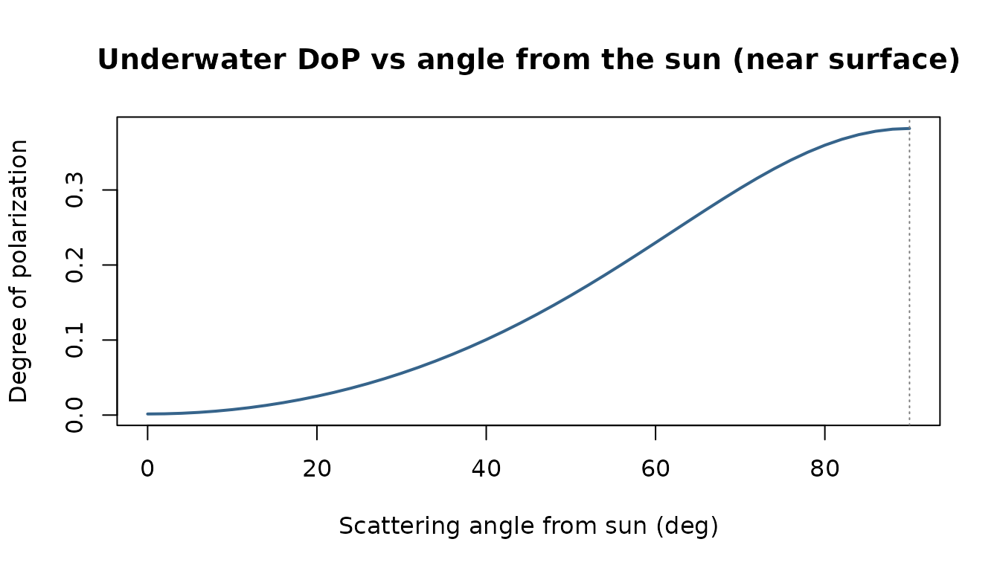
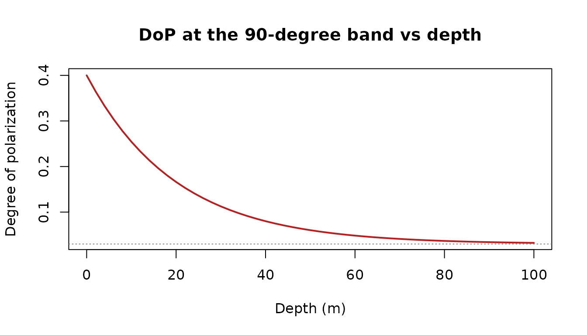

# Polarization of the underwater light field

Sunlight scattered by water becomes partially **linearly polarized**,
and many aquatic animals — cephalopods, stomatopods, many crustaceans
and some fish — see that polarization and use it for navigation,
contrast enhancement, and communication. luxR provides a tunable,
Rayleigh-like single-scattering approximation to the underwater
polarization field: enough to build intuition and explore geometry, but
**not** a vector radiative-transfer solution.

> **Model status:**
> [`underwater_polarization()`](https://johnkirwan.github.io/luxR/reference/underwater_polarization.md)
> is an uncalibrated approximation, not a quantitative prediction. Its
> result carries a `luxR.polarization` attribute recording that status
> and the exact parameter values. Quantitative use requires calibration
> for the relevant wavelength, water type, surface state, depth, and
> viewing geometry.

## The model

For singly (Rayleigh-like) scattered light, the **degree of
polarization** (DoP) depends on the scattering angle $`\Theta`$ between
the line of sight and the refracted solar beam,

``` math
 DoP(\Theta) = DoP_{max}\,\frac{\sin^2\Theta}{1 + \cos^2\Theta}, 
```

peaking at $`\Theta = 90^\circ`$ and vanishing toward the sun and
anti-sun. With depth, multiple scattering randomizes the field, so DoP
relaxes toward an asymptotic floor. The sun’s beam is refracted at the
surface into Snell’s window first:

``` r

refracted_solar_angle(c(0, 30, 60, 90))   # in-water solar zenith (deg)
```

    ## [1]  0.00000 22.03011 40.51759 48.60663

## Degree of polarization across the sky

With the sun overhead, polarization is strongest when looking
horizontally (90° from the sun) and disappears looking straight up at
the sun:

``` r

vz  <- seq(0, 90, by = 2)
res <- underwater_polarization(view_zenith = vz, sun_zenith = 0, depth = 1)

plot(res$scattering_angle, res$dop, type = "l", lwd = 2, col = "steelblue4",
     xlab = "Scattering angle from sun (deg)",
     ylab = "Degree of polarization",
     main = "Underwater DoP vs angle from the sun (near surface)")
abline(v = 90, lty = 3, col = "grey50")
```



## How polarization fades with depth

Looking at the 90° band (maximally polarized at the surface), DoP
relaxes toward the deep asymptotic value as multiple scattering takes
over:

``` r

depths <- seq(0, 100, by = 2)
dz <- underwater_polarization(view_zenith = 90, sun_zenith = 0,
                              depth = depths, dop_max = 0.4, dop_asym = 0.03)

plot(depths, dz$dop, type = "l", lwd = 2, col = "firebrick",
     xlab = "Depth (m)", ylab = "Degree of polarization",
     main = "DoP at the 90-degree band vs depth")
abline(h = 0.03, lty = 3, col = "grey50")
```



The `dop_max`, `dop_asym`, and `z_p` arguments let you tune the
approximation to a water type or to field measurements. Their defaults
are illustrative:

| Parameter | Default | Evidence and valid domain |
|----|---:|----|
| `dop_max` | 0.4 | Upper end of the roughly 0.25–0.40 maxima reported by Cronin & Shashar (2001) at 15 m in clear tropical marine water. The function defines this parameter at depth zero, so the observation is context rather than a calibration. |
| `dop_asym` | 0.03 | Heuristic deep-field floor. It has no empirical universal domain and must be calibrated for quantitative use. |
| `z_p` | 20 m | Heuristic relaxation scale, not a measured attenuation length. It must be calibrated for quantitative use. |
| `n` | 1.333 | Conventional visible-light approximation for water. Refractive index varies with wavelength, temperature, and salinity. |

Cronin & Shashar measured clear tropical reef water at 15 m over 350–600
nm and found the strongest polarization 60–90° from the sun. The package
tests this angular pattern as a literature-consistency benchmark. It
does not treat that qualitative agreement as calibration.

## The e-vector

The angle of polarization (`aop`) is perpendicular to the scattering
plane. It is returned alongside DoP and is `NA` when looking straight
along the solar beam, where the e-vector is undefined:

``` r

underwater_polarization(view_zenith = c(0, 45, 90), view_azimuth = 0,
                        sun_zenith = 30, sun_azimuth = 0, depth = 5)
```

    ##   scattering_angle        dop aop
    ## 1         22.03011 0.03020901  90
    ## 2         22.96989 0.03231232  90
    ## 3         67.96989 0.24130938  90

For Stokes-vector inputs you can also compute the descriptors directly
with
[`degree_of_polarization()`](https://johnkirwan.github.io/luxR/reference/degree_of_polarization.md)
and
[`angle_of_polarization()`](https://johnkirwan.github.io/luxR/reference/angle_of_polarization.md).
Invalid Stokes states whose polarized intensity exceeds total intensity
are rejected rather than silently returning a degree greater than one.
