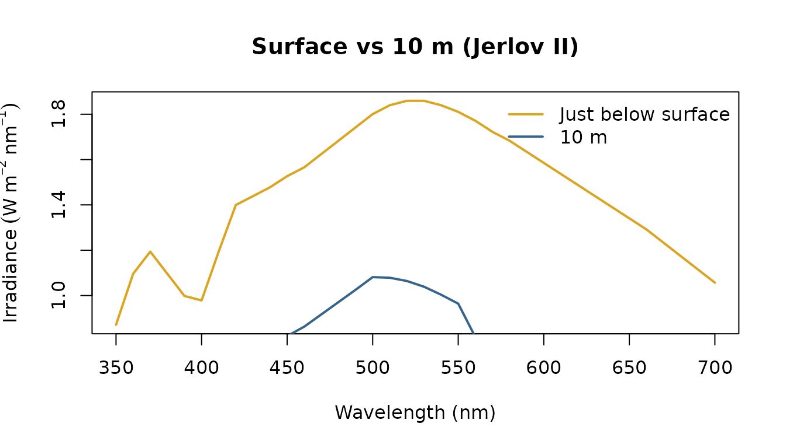
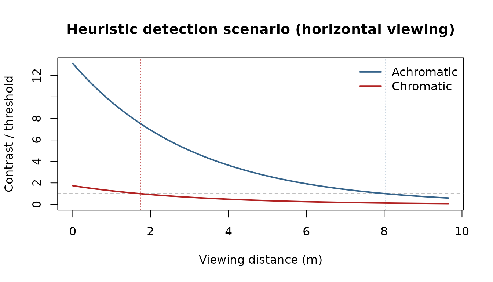

# Seeing through water: from sunlight to detection

This vignette runs a single question end to end: **can a fish, at depth,
detect a reddish object against the open-water background — and how far
away?** It chains the three stages luxR is built around:

1.  **Sunlight to depth** — cross the air–water surface and attenuate
    the solar spectrum through a Jerlov water type.
2.  **Light to capture** — what the fish’s photoreceptors actually
    catch, allowing for self-screening.
3.  **Capture to detection** — the inherent object/background contrast
    and the distance at which it falls below threshold.

``` r

library(luxR)
```

## 1. Sunlight to depth

Start with the clear-noon solar spectrum just above the surface. A flat
air–water interface reflects a few percent of it away (Fresnel);
[`surface_transmittance()`](https://johnkirwan.github.io/luxR/reference/surface_transmittance.md)
gives the fraction that actually enters the water.

``` r

sp    <- solar_irradiance("clear_noon")   # W m⁻² nm⁻¹, above surface
lam   <- sp$wavelength

tau   <- surface_transmittance(angle = 30)            # sun 30 deg from vertical
E_sub <- sp$irradiance * tau                          # just below the surface
round(tau, 3)
```

    ## [1] 0.979

Now propagate that subsurface spectrum down through Jerlov type II water
with Beer–Lambert attenuation. The water is a strong spectral filter:
red light is gone within a few metres, leaving a blue-green field at
depth.

``` r

depth  <- 10                                          # metres
at_10m <- light_at_depth("clear_noon", "II", depth,
                         wavelength_policy = "trim",
                         surface_source = "direct", surface_angle = 30)
lam_depth <- at_10m$lambda
supported <- lam >= min(lam_depth) & lam <= max(lam_depth)
E_10m  <- at_10m$irradiance
E_sub <- E_sub[supported]
lam <- lam_depth

plot(lam, E_sub, type = "l", col = "goldenrod", lwd = 2,
     xlab = "Wavelength (nm)", ylab = bquote(Irradiance~(.(unit_expression("W/m2/nm")))),
     main = "Surface vs 10 m (Jerlov II)")
lines(lam, E_10m, col = "steelblue4", lwd = 2)
legend("topright", c("Just below surface", "10 m"),
       col = c("goldenrod", "steelblue4"), lwd = 2, bty = "n")
```



## 2. Light to capture

Here, quantum catch means the in-water photon irradiance weighted by the
receptor’s spectral sensitivity. It remains an area-normalised quantity,
not an absolute per-receptor photon rate. The sensitivity itself is not
the bare pigment template — a real outer segment is partly
self-screening, which broadens the effective curve.
[`receptor_absorptance()`](https://johnkirwan.github.io/luxR/reference/receptor_absorptance.md)
applies that for a chosen axial optical density.

``` r

viewer <- "Danio rerio"                               # a tetrachromat
recs   <- unique(subset(species_sensitivities,
                        species == viewer)$receptor)

lam_s  <- seq(300, 750, by = 1)
catch  <- sapply(recs, function(r) {
  row <- subset(species_sensitivities,
                species == viewer & receptor == r)
  tmpl <- govardovskii_template(lam_s, row$lambda_max[1], row$chromophore[1])
  S    <- receptor_absorptance(tmpl, optical_density = 0.4)   # self-screening
  quantum_catch(E_10m, lam, S, input_unit = "W/m2/nm")
})
round(catch)
```

    ##      UV-cone       S-cone       M-cone       L-cone 
    ## 2.165623e+19 6.750210e+19 1.459543e+20 1.677082e+20

The catches span almost an order of magnitude across the four cones — a
direct readout of how much each receptor’s sensitivity overlaps the
residual blue-green field at depth, rather than the broad, even
excitation it would receive at the surface.

## 3. Capture to detection

Now the target. Give it a reddish reflectance and view it against a flat
grey background under the 10 m light field.
[`inherent_contrast()`](https://johnkirwan.github.io/luxR/reference/inherent_contrast.md)
returns both an achromatic (brightness) Weber contrast and a chromatic
distance (ΔS, in JNDs) for the viewer’s receptors.

``` r

grey <- rep(0.30, length(lam))
red  <- 0.20 + 0.25 * exp(-((lam - 625) / 35)^2)

ic <- inherent_contrast(red, grey, E_10m, lam, species = viewer)
ic
```

    ## $achromatic
    ## [1] -0.2622355
    ## 
    ## $chromatic
    ## [1] 1.743446

The default scenario assumes both scalar contrasts decay with distance
as veiling light replaces the object (`C(r) = C0 * exp(-c r)`). This is
a teaching heuristic, not an empirically validated prediction of an
animal’s actual detection range.
[`detectability()`](https://johnkirwan.github.io/luxR/reference/detectability.md)
bundles the inherent contrast, the threshold-distance estimate per
channel, and the contrast-vs-distance curve. We pass a real beam
attenuation `c = a + b` rather than the `Kd * kd_to_c` proxy.

``` r

c_beam <- beam_attenuation(absorption = 0.20, scattering = 0.12)   # 1/m
Kd_ref <- jerlov_Kd("II", lambda = 490)

d <- detectability(red, grey, E_10m, lam, Kd = Kd_ref,
                   beam_c = c_beam, species = viewer)
d
```

    ## <lux_detection> horizontal viewing, Danio rerio 
    ##   model: scalar contrast/JND heuristic scenario estimate 
    ##   validation: not empirically validated as an actual detection range
    ##   achromatic: C0 = -0.262 (Weber)   -> estimate 8.04 m  (thr 0.020; crossed)
    ##   chromatic : dS = 1.743 JND        -> estimate 1.74 m  (thr 1.00 JND; crossed)

``` r

plot(d)
```



Under this heuristic the two channels behave very differently. The
brightness (achromatic) difference stays above threshold for several
metres, while the colour signal — only just above 1 JND at zero distance
— washes out almost immediately as veiling light floods in. Detecting an
object by its colour underwater is demanding: it needs both photons and
inherent contrast to spare. Looking **up** (against the brighter
surface) extends the range, because the contrast-attenuation coefficient
becomes `c - Kd`:

``` r

detection_range(red, grey, E_10m, lam, Kd = Kd_ref, beam_c = c_beam,
                species = viewer, channel = "achromatic",
                direction = "up")$achromatic
```

    ## [1] 9.638616

For chromatic work, prefer the wavelength-resolved path model. It
requires an explicit beam-attenuation spectrum and veiling radiance
rather than treating a zero-distance JND as a scalar that decays
exponentially. In this illustrative geometry, the grey background is
also the asymptotic veiling field:

``` r

Kd_lambda <- jerlov_Kd("II", lambda = lam)
c_lambda  <- 1.5 * Kd_lambda
veil      <- grey * irradiance2radiance(E_10m, geometry = "lambertian")

d_spectral <- detectability(
  red, grey, E_10m, lam,
  Kd = Kd_lambda,
  beam_c = c_lambda,
  species = viewer,
  model = "spectral_path",
  veiling = veil,
  max_distance = 50,
  search_points = 201
)
d_spectral
```

    ## <lux_detection> horizontal viewing, Danio rerio 
    ##   model: spectral-path scenario estimate 
    ##   validation: not empirically validated as an actual detection range
    ##   achromatic: C0 = -0.262 (Weber)   -> estimate 28.08 m  (thr 0.020; crossed)
    ##   chromatic : dS = 1.743 JND        -> estimate 13.14 m  (thr 1.00 JND; crossed)

This remains a scenario estimate: the spectral calculation improves the
path physics and receptor calculation, but it does not add target size,
acuity, photon limits, behaviour, or empirical validation for the
organism.

## Summary

From a single sunlight spectrum we crossed the surface, propagated to
depth, computed photoreceptor quantum catches (with self-screening), and
turned the object/background spectra into a heuristic threshold-distance
scenario — the full `light → capture → detection` chain, each step a
documented luxR function.
