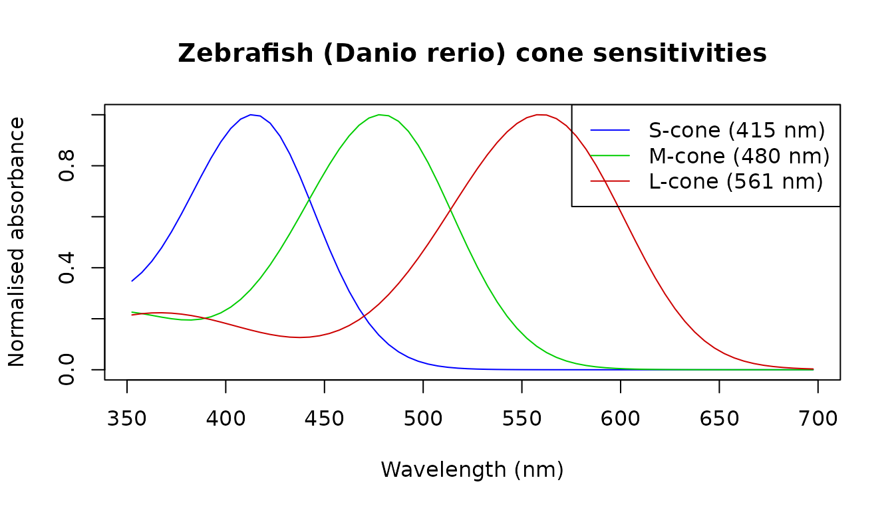
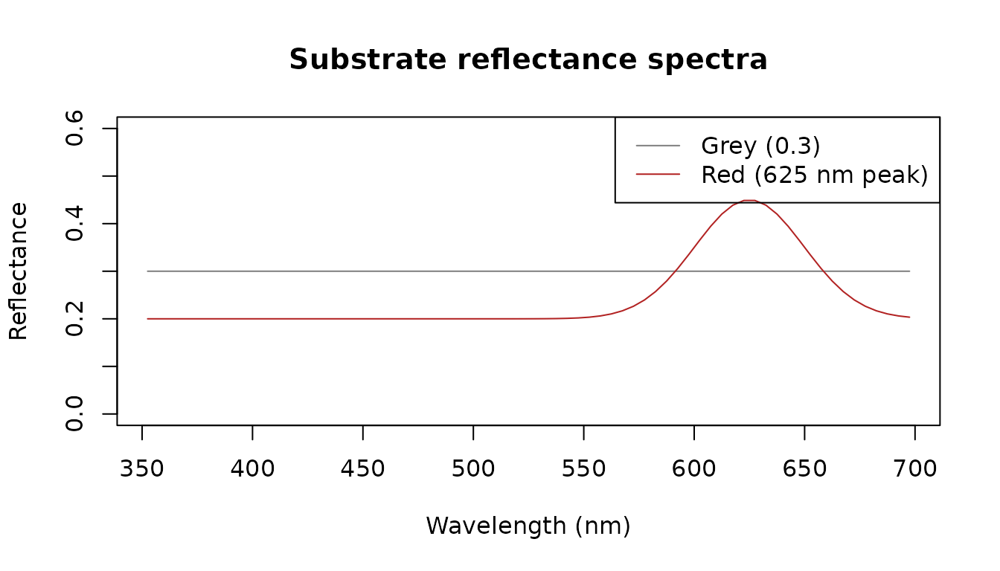
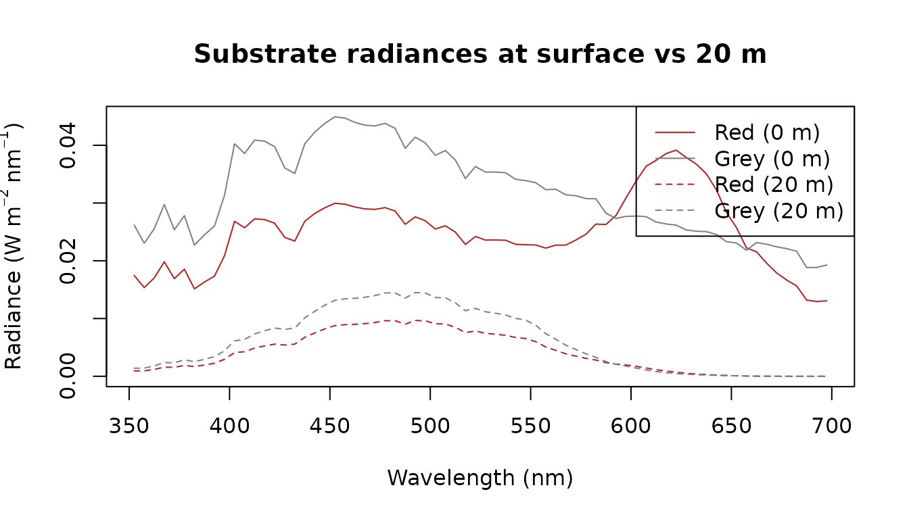
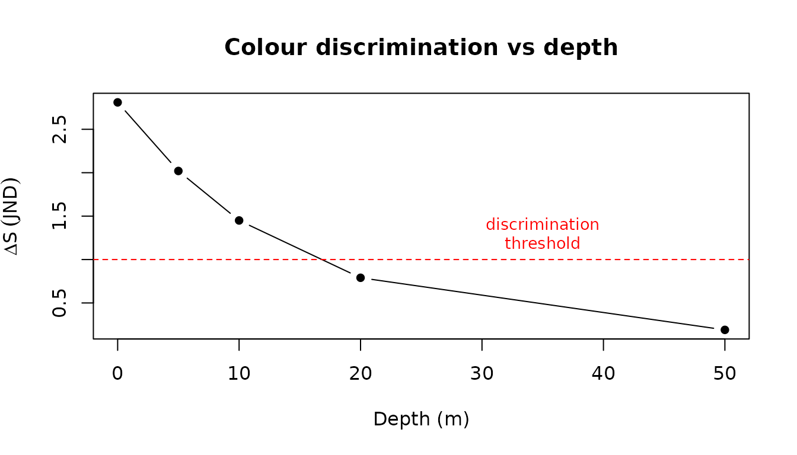

# From photons to perception

A sensory biologist has spectral reflectance measurements of two
substrates and wants to know whether a fish can discriminate them — and
at what depth discrimination fails as the blue-shifted underwater
illuminant narrows the visible contrast between the two surfaces.

## Units and conversions

We begin with the Naples surface spectrum and demonstrate the unit
conversions central to sensory ecology. The same photon field can be
expressed as an energy flux (W m⁻² nm⁻¹), a photon flux (µmol m⁻² s⁻¹
nm⁻¹), an illuminance (lux), or a scotopic illuminance.

``` r

library(luxR)

x0m   <- from_naples("0m")          # µmol m⁻² s⁻¹ nm⁻¹
x0m_W <- convert_unit(x0m, "W/m2/nm")
x0m_W
```

    ## <lux_spectrum> irradiance [W/m2/nm] | 352.5-862.5 nm, 5 nm bins (103 pts)
    ##   depth: 0m
    ##   source: Naples
    ##   reference_depth_m: 0
    ##   reference_medium: water
    ##   provenance: Naples
    ##    provenance: naples-mare-chiaro-legacy
    ##    provenance: naplesBokKirwan2021
    ##    provenance: unpublished-author-provided-data
    ##    provenance: not-applicable
    ##    provenance: 2021-12-31
    ##    provenance: legacy bundled snapshot; redistribution terms not documented
    ##    provenance: legacy canonical snapshot extracted from luxR commit 2375244
    ##    provenance: data-raw/naples_legacy_snapshot.csv
    ##    provenance: 5952acfab4a04ea1b02eb085e6a768d5
    ##    provenance: wv=nm;depth_0m|depth_5m|depth_10m=umol/m2/s/nm
    ##    provenance: c(352.5, 862.5)
    ##    provenance: 5
    ##    provenance: parse canonical processed snapshot; validate schema grid and non-negative irradiance
    ##    provenance: naples-legacy-v1
    ##    provenance: list(reference_depth_m = c(0, 5, 10), reference_medium = "water")
    ##   import: bundled/reference source
    ##    import: legacy canonical snapshot extracted from luxR commit 2375244
    ##    import: data-raw/naples_legacy_snapshot.csv
    ##    import: 5952acfab4a04ea1b02eb085e6a768d5
    ##    import: naples-legacy-v1
    ##    import: 0.1.1
    ##    import: 5722b6ca6b7981b412112374e05be17c572a54aa
    ##    import: parse canonical processed snapshot; validate schema grid and non-negative irradiance

``` r

unit_table <- data.frame(
  Quantity = c(
    "Integrated energy flux in PAR window (W m⁻²)",
    "Photon flux — PAR (µmol m⁻² s⁻¹)",
    "Photopic illuminance (lux)",
    "Scotopic illuminance (scotopic lux)"
  ),
  Value = c(
    round(sum(x0m_W$E[x0m_W$lambda >= 400 &
                      x0m_W$lambda <= 700]) * x0m_W$binwidth, 1),
    round(par_irradiance(x0m_W), 1),
    round(irradiance2lux(x0m_W), 0),
    round(scotopic_lux(x0m_W), 0)
  )
)
knitr::kable(unit_table)
```

| Quantity                                     |   Value |
|:---------------------------------------------|--------:|
| Integrated energy flux in PAR window (W m⁻²) |   102.8 |
| Photon flux — PAR (µmol m⁻² s⁻¹)             |   455.9 |
| Photopic illuminance (lux)                   | 24726.0 |
| Scotopic illuminance (scotopic lux)          | 66487.0 |

Photopic lux weights visible wavelengths by the human eye’s sensitivity
curve; scotopic lux uses the dark-adapted (rod) curve. Neither preserves
spectral shape — which matters when asking what a non-human visual
system actually detects.

> **Numeric API note:** All functions also accept plain numeric vectors.
> For example, `irradiance2lux(x0m_W$E, x0m_W$lambda)`.

## How the spectrum changes with depth

Using a Jerlov Type II open-water model we propagate the surface
spectrum to five depths and compare radiometric and photometric
summaries.

``` r

x0m_Jerlov <- x0m_W[350, 700]
lam   <- x0m_Jerlov$lambda
Kd_II <- jerlov_Kd("II", lam)
specs <- propagate_spectrum(x0m_Jerlov, Kd_II, from = 0,
                            to = c(0, 5, 10, 20, 50))
```

``` r

depth_table <- data.frame(
  depth_m  = c(0, 5, 10, 20, 50),
  PAR_umol = round(sapply(specs, par_irradiance), 1),
  lux      = round(sapply(specs, irradiance2lux), 0)
)
knitr::kable(depth_table,
             col.names = c("Depth (m)",
                           "PAR (µmol m⁻² s⁻¹)",
                           "Photopic illuminance (lux)"))
```

|     | Depth (m) | PAR (µmol m⁻² s⁻¹) | Photopic illuminance (lux) |
|:----|----------:|-------------------:|---------------------------:|
| 0   |         0 |              455.9 |                      24718 |
| 5   |         5 |              261.0 |                      16009 |
| 10  |        10 |              171.9 |                      10816 |
| 20  |        20 |               84.6 |                       5303 |
| 50  |        50 |               12.9 |                        792 |

PAR retains spectral shape and photon-flux information relevant to
photoreception. Lux collapses the spectrum into a single number weighted
for human daytime vision — it can mislead when applied to non-human or
scotopic scenarios.

## Building a visual model

We use the zebrafish (*Danio rerio*) cone sensitivities retrieved from
the package database via
[`species_LEF()`](https://johnkirwan.github.io/luxR/reference/species_LEF.md).
Zebrafish (*Danio rerio*) are tetrachromats with four cone classes (UV,
S, M, L), but we restrict the model to the three longer-wavelength cones
(S at 415 nm, M at 480 nm, L at 561 nm) because the UV-cone’s peak lies
at the edge of the modelled illuminant range.

``` r

sws_df <- species_LEF("Danio rerio", receptor = "S-cone", lambda = lam)
mws_df <- species_LEF("Danio rerio", receptor = "M-cone", lambda = lam)
lws_df <- species_LEF("Danio rerio", receptor = "L-cone", lambda = lam)

plot(sws_df$lambda, sws_df$S, type = "l", col = "blue",
     xlab = "Wavelength (nm)", ylab = "Normalised absorbance",
     main = "Zebrafish (Danio rerio) cone sensitivities",
     ylim = c(0, 1))
lines(mws_df$lambda, mws_df$S, col = "green3")
lines(lws_df$lambda, lws_df$S, col = "red3")
legend("topright",
       legend = c("S-cone (415 nm)", "M-cone (480 nm)", "L-cone (561 nm)"),
       col = c("blue", "green3", "red3"), lty = 1)
```



[`quantum_catch()`](https://johnkirwan.github.io/luxR/reference/quantum_catch.md)
integrates photon irradiance weighted by dimensionless sensitivity over
wavelength. Its result is in photons m⁻² s⁻¹ at the measurement plane;
it is not an absolute photons-per-second rate for one receptor. It takes
a numeric irradiance vector with an explicit unit, so we extract `$E`
from each depth spectrum and declare its energy unit.

``` r

qc_list <- lapply(specs, function(s) {
  data.frame(
    S = quantum_catch(s$E, s$lambda, sws_df,
                      input_unit = "W/m2/nm", binwidth = s$binwidth),
    M = quantum_catch(s$E, s$lambda, mws_df,
                      input_unit = "W/m2/nm", binwidth = s$binwidth),
    L = quantum_catch(s$E, s$lambda, lws_df,
                      input_unit = "W/m2/nm", binwidth = s$binwidth)
  )
})
qc_df         <- do.call(rbind, qc_list)
qc_df$depth_m <- c(0, 5, 10, 20, 50)
qc_df$M_L     <- round(qc_df$M / qc_df$L, 3)

knitr::kable(qc_df[, c("depth_m", "S", "M", "L", "M_L")],
             digits = 2,
             col.names = c("Depth (m)", "S-cone catch",
                           "M-cone catch", "L-cone catch", "M/L ratio"))
```

|     | Depth (m) | S-cone catch | M-cone catch | L-cone catch | M/L ratio |
|:----|----------:|-------------:|-------------:|-------------:|----------:|
| 0   |         0 | 6.484939e+19 | 1.014862e+20 | 1.178168e+20 |      0.86 |
| 5   |         5 | 4.290674e+19 | 7.411390e+19 | 7.656188e+19 |      0.97 |
| 10  |        10 | 2.868235e+19 | 5.443117e+19 | 5.162111e+19 |      1.05 |
| 20  |        20 | 1.317081e+19 | 2.973694e+19 | 2.509909e+19 |      1.19 |
| 50  |        50 | 1.503718e+18 | 5.152246e+18 | 3.687906e+18 |      1.40 |

As depth increases the M/L ratio rises: the blue-shifted deep illuminant
peaks near 500 nm, which aligns with the M-cone (480 nm) better than the
L-cone (561 nm), shifting the chromatic balance available to the fish.

## Reflectance to radiance

We define two synthetic substrates: a spectrally flat grey (reflectance
= 0.3 everywhere) and a brownish-red substrate with a Gaussian peak near
625 nm.

``` r

grey_R <- lux_spectrum(rep(0.3, length(lam)), lam,
                       quantity = "reflectance", unit = "dimensionless")
red_E  <- 0.2 + 0.25 * exp(-((lam - 625) / 35)^2)
red_R  <- lux_spectrum(red_E, lam,
                       quantity = "reflectance", unit = "dimensionless")

plot(grey_R$lambda, grey_R$E, type = "l", col = "grey50",
     ylim = c(0, 0.6),
     xlab = "Wavelength (nm)", ylab = "Reflectance",
     main = "Substrate reflectance spectra")
lines(red_R$lambda, red_R$E, col = "firebrick")
legend("topright", legend = c("Grey (0.3)", "Red (625 nm peak)"),
       col = c("grey50", "firebrick"), lty = 1)
```



[`reflectance_to_radiance()`](https://johnkirwan.github.io/luxR/reference/reflectance_to_radiance.md)
multiplies each reflectance by the depth-dependent illuminant to give
the stimulus reaching the observer’s eye.

``` r

rad_grey_0m  <- reflectance_to_radiance(grey_R, specs[["0"]])
rad_red_0m   <- reflectance_to_radiance(red_R,  specs[["0"]])
rad_grey_20m <- reflectance_to_radiance(grey_R, specs[["20"]])
rad_red_20m  <- reflectance_to_radiance(red_R,  specs[["20"]])

ylim_rad <- range(c(rad_red_0m$E, rad_red_20m$E,
                    rad_grey_0m$E, rad_grey_20m$E))
plot(rad_red_0m$lambda, rad_red_0m$E, type = "l", col = "firebrick",
     ylim = ylim_rad,
     xlab = "Wavelength (nm)",
     ylab = expression("Radiance (W m"^{-2}~"nm"^{-1}*")"),
     main = "Substrate radiances at surface vs 20 m")
lines(rad_grey_0m$lambda,  rad_grey_0m$E,  col = "grey50")
lines(rad_red_20m$lambda,  rad_red_20m$E,  col = "firebrick", lty = 2)
lines(rad_grey_20m$lambda, rad_grey_20m$E, col = "grey50",    lty = 2)
legend("topright",
       legend = c("Red (0 m)", "Grey (0 m)",
                  "Red (20 m)", "Grey (20 m)"),
       col = c("firebrick", "grey50", "firebrick", "grey50"),
       lty = c(1, 1, 2, 2))
```



At 20 m the two radiance curves converge: the blue-shifted illuminant
strongly attenuates the red substrate’s 625 nm peak, leaving it nearly
indistinguishable from the flat grey.

## Colour discrimination

[`colour_jnd()`](https://johnkirwan.github.io/luxR/reference/colour_jnd.md)
implements the Vorobyev–Osorio receptor-noise-limited model. A JND ≥ 1
means the pair is reliably discriminable; JND \< 1 means it is not. We
use zebrafish (*Danio rerio*) S-, M- and L-cone sensitivities with a
Weber fraction of 0.05, comparing the grey and red substrates. When
`receptor` is omitted,
[`colour_jnd()`](https://johnkirwan.github.io/luxR/reference/colour_jnd.md)
uses the species’ cited default chromatic channel from
`species_channels`; it never promotes rods, irradiance detectors, or
incomplete receptor sets to colour channels.

[`colour_jnd()`](https://johnkirwan.github.io/luxR/reference/colour_jnd.md)
takes numeric radiance vectors (W m⁻² nm⁻¹), so we extract `$E` and
`$lambda` from the `lux_spectrum` objects.

``` r

depths     <- c(0, 5, 10, 20, 50)
depth_keys <- as.character(depths)

jnd_vals <- sapply(depth_keys, function(d) {
  r1 <- reflectance_to_radiance(grey_R, specs[[d]])
  r2 <- reflectance_to_radiance(red_R,  specs[[d]])
  colour_jnd(
    stim1    = r1$E,
    stim2    = r2$E,
    lambda   = r1$lambda,
    species  = "Danio rerio",
    receptor = c("S-cone", "M-cone", "L-cone"),
    noise    = 0.05,
    binwidth = r1$binwidth
  )
})

jnd_table <- data.frame(depth_m = depths, JND = round(jnd_vals, 2))
knitr::kable(jnd_table,
             col.names = c("Depth (m)", "ΔS (JND)"))
```

|     | Depth (m) | ΔS (JND) |
|:----|----------:|---------:|
| 0   |         0 |     2.81 |
| 5   |         5 |     2.02 |
| 10  |        10 |     1.45 |
| 20  |        20 |     0.79 |
| 50  |        50 |     0.19 |

``` r

plot(jnd_table$depth_m, jnd_table$JND, type = "b", pch = 16,
     xlab = "Depth (m)",
     ylab = expression(Delta * S ~ (JND)),
     main = "Colour discrimination vs depth")
abline(h = 1, lty = 2, col = "red")
text(35, 1.3, "discrimination\nthreshold", col = "red", cex = 0.85)
```



``` r

fail_idx <- which(jnd_table$JND < 1)
if (length(fail_idx) > 0) {
  cat(sprintf(
    "Discrimination fails (JND < 1) at %d m depth.\n",
    jnd_table$depth_m[fail_idx[1]]
  ))
} else {
  cat("JND remains above 1 at all modelled depths.\n")
}
```

    ## Discrimination fails (JND < 1) at 20 m depth.

The model predicts that the zebrafish can discriminate the grey and red
substrates in well-lit shallow water (JND ≈ 2–3 near the surface) but
loses the ability by 20 m, where the blue-shifted Jerlov II illuminant
has attenuated the red substrate’s 625 nm peak sufficiently to render it
indistinguishable from the flat grey (JND \< 1).

## Validation against pavo

luxR’s
[`colour_jnd()`](https://johnkirwan.github.io/luxR/reference/colour_jnd.md)
is the Vorobyev–Osorio receptor-noise-limited model, the same model
implemented by the widely used
[pavo](https://CRAN.R-project.org/package=pavo) package
([`vismodel()`](https://pavo.colrverse.com/reference/vismodel.html) +
[`coldist()`](https://pavo.colrverse.com/reference/coldist.html)). Given
identical receptor sensitivities, stimuli, and noise, the two must
agree. They do — to machine precision — once the conventions are
matched:

- feed pavo luxR’s own Govardovskii templates as the visual system;
- luxR integrates **photon** catch (∝ `E × lambda`); reproduce that in
  pavo with an illuminant proportional to wavelength;
- luxR’s per-receptor noise is the Weber fraction directly; reproduce
  that with equal cone ratios (`n = 1`), so `e_i = weber`;
- use raw quantum catches:
  `vismodel(qcatch = "Qi", vonkries = FALSE, relative = FALSE)`.

``` r

library(pavo)

lam <- 300:750
s1  <- approx(solar_spectra$clear_noon$wavelength,
              solar_spectra$clear_noon$irradiance, lam, rule = 2)$y
s2  <- approx(solar_spectra$underwater_10m$wavelength,
              solar_spectra$underwater_10m$irradiance, lam, rule = 2)$y
w   <- 0.05

pavo_dS <- function(species) {
  members <- species_channels[
    species_channels$species == species &
      species_channels$channel_role == "chromatic" &
      species_channels$is_default,
  ]
  species_rows <- species_sensitivities[
    species_sensitivities$species == species,
  ]
  recs <- species_rows[match(members$receptor, species_rows$receptor), ]
  S <- sapply(seq_len(nrow(recs)), function(i)
    govardovskii_template(lam, recs$lambda_max[i], recs$chromophore[i])$S)
  colnames(S) <- make.unique(recs$receptor)
  vm <- vismodel(as.rspec(data.frame(wl = lam, s1 = s1, s2 = s2), lim = range(lam)),
                 visual = as.rspec(data.frame(wl = lam, S), lim = range(lam)),
                 illum = lam, qcatch = "Qi", vonkries = FALSE,
                 relative = FALSE, achromatic = "none")
  coldist(vm, noise = "neural", n = rep(1, nrow(recs)),
          weber = w, weber.ref = 1, achromatic = FALSE)$dS[1]
}

species <- c("Homo sapiens", "Apis mellifera", "Danio rerio")
cmp <- data.frame(
  species = species,
  luxR    = sapply(species, function(sp)
              colour_jnd(s1, s2, lambda = lam, species = sp, noise = w)),
  pavo    = sapply(species, function(sp) suppressMessages(pavo_dS(sp)))
)
cmp$abs_diff <- abs(cmp$luxR - cmp$pavo)
knitr::kable(cmp, digits = c(0, 6, 6, 14),
             col.names = c("Species", "luxR ΔS", "pavo ΔS", "|difference|"))
```

|                | Species        |  luxR ΔS |  pavo ΔS | \|difference\| |
|:---------------|:---------------|---------:|---------:|---------------:|
| Homo sapiens   | Homo sapiens   | 1.865302 | 1.865302 |        2.0e-14 |
| Apis mellifera | Apis mellifera | 0.943538 | 0.943538 |        1.2e-13 |
| Danio rerio    | Danio rerio    | 1.768219 | 1.768219 |        1.5e-13 |

The agreement is a useful regression guard as well as a check on
correctness: `tests/testthat/test-pavo-validation.R` asserts it
automatically wherever pavo is installed.

## Interoperating with pavo

Beyond validation, luxR and pavo *compose*: luxR propagates the light
field through the water, and pavo analyses the resulting colours.
[`as_rspec()`](https://johnkirwan.github.io/luxR/reference/as_rspec.md)
converts luxR spectra into pavo’s `rspec` class, after which the whole
pavo toolkit
([`vismodel()`](https://pavo.colrverse.com/reference/vismodel.html),
[`coldist()`](https://pavo.colrverse.com/reference/coldist.html),
[`colspace()`](https://pavo.colrverse.com/reference/colspace.html),
plotting) is available; an
[`as_lux_spectrum()`](https://johnkirwan.github.io/luxR/reference/as_lux_spectrum.md)
method converts back.

The pipeline below propagates daylight to 15 m in Jerlov II water with
luxR, then uses that **in-water light field as the illuminant** for a
pavo visual model of two substrates — a calculation neither package does
alone.

``` r

library(pavo)

# luxR: the downwelling light field at 15 m (this becomes pavo's illuminant)
Ld  <- light_at_depth("clear_noon", "II", depth = 15,
                      wavelength_policy = "trim")

# Two object reflectances, bridged into pavo via as_rspec() (interpolated to 1 nm)
lam   <- Ld$lambda
gauss <- function(centre) 0.2 + 0.25 * exp(-((lam - centre) / 35)^2)
refl  <- as_rspec(list(
  red_substrate  = as_lux_spectrum(
    gauss(625), lambda = lam,
    quantity = "reflectance", unit = "dimensionless"
  ),
  grey_substrate = as_lux_spectrum(
    rep(0.3, length(lam)), lambda = lam,
    quantity = "reflectance", unit = "dimensionless"
  )
), lim = c(300, 700))   # match pavo's built-in honeybee visual system

# Put luxR's light field on the rspec's (1 nm) grid so it can serve as the illuminant
illum <- approx(Ld$lambda, Ld$irradiance, refl$wl, rule = 2)$y

# pavo: model a honeybee viewing those substrates UNDER luxR's underwater light
vm <- vismodel(refl, visual = "apis", illum = illum,
               qcatch = "Qi", relative = FALSE)
coldist(vm, n = c(1, 1, 1), achromatic = FALSE)[, c("patch1", "patch2", "dS")]
```

    ##          patch1         patch2        dS
    ## 1 red_substrate grey_substrate 0.2932094

luxR owns the water; pavo owns the colour space, and
[`as_rspec()`](https://johnkirwan.github.io/luxR/reference/as_rspec.md)
is the seam.

## Interoperating with colourvision

luxR also bridges into
[colourvision](https://CRAN.R-project.org/package=colourvision), which
implements receptor-noise-limited and colour-space models. As with pavo,
luxR propagates the in-water light field and colourvision analyses the
resulting colours. colourvision has no dedicated spectral class: each
model argument is a plain data frame whose first column is wavelength.
[`as_colourvision()`](https://johnkirwan.github.io/luxR/reference/as_colourvision.md)
produces that shape, and
[`species_sensitivity_matrix()`](https://johnkirwan.github.io/luxR/reference/species_sensitivity_matrix.md)
builds the receptor matrix `C` from luxR’s own Govardovskii templates.

``` r

library(colourvision)

lam <- 300:700

# luxR: the downwelling light field at 15 m in Jerlov II water becomes
# colourvision's illuminant I.
Ld <- light_at_depth("clear_noon", "II", depth = 15, wavelength_policy = "trim")
I <- as_colourvision(
  as_lux_spectrum(
    stats::approx(Ld$lambda, Ld$irradiance, lam, rule = 2)$y,
    lambda = lam, quantity = "irradiance", unit = "W/m2/nm"
  ),
  name = "I")

# Two object reflectances as R1 / R2, flat background Rb.
R1 <- data.frame(wl = lam, R = 0.2 + 0.25 * exp(-((lam - 550) / 30)^2))
R2 <- data.frame(wl = lam, R = 0.2 + 0.25 * exp(-((lam - 600) / 30)^2))
Rb <- data.frame(wl = lam, R = rep(0.1, length(lam)))

# luxR's own receptors as colourvision's C (photon-weighted).
C <- species_sensitivity_matrix("Apis mellifera", lambda = lam)

RNLmodel(model = "log", R1 = R1, R2 = R2, Rb = Rb, I = I, C = C,
         noise = TRUE, e = rep(0.05, ncol(C) - 1),
         interpolate = FALSE, nm = lam)[["deltaS"]]
```

    ## [1] 4.993406

luxR owns the water; colourvision owns the colour space, and
[`as_colourvision()`](https://johnkirwan.github.io/luxR/reference/as_colourvision.md)
plus
[`species_sensitivity_matrix()`](https://johnkirwan.github.io/luxR/reference/species_sensitivity_matrix.md)
are the seam.

### Validation against colourvision

luxR’s
[`colour_jnd()`](https://johnkirwan.github.io/luxR/reference/colour_jnd.md)
and colourvision’s `RNLmodel(model = "log")` implement the same
Vorobyev-Osorio model. Given matched sensitivities and noise they agree
to numerical precision: the photon-vs-energy integration difference is
absorbed by `species_sensitivity_matrix(weight = "photon")` (which emits
`S` `*` `lambda`), and colourvision’s background von Kries factor
cancels in the pairwise log difference.
`tests/testthat/test-colourvision-validation.R` asserts this
automatically wherever colourvision is installed.
